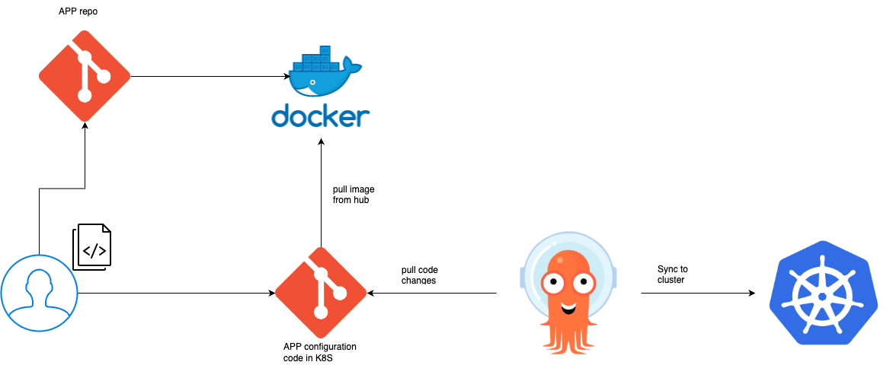

# automated-cd-pipeline-with-argocd-in-K8S

## Run
  - [Purpose](#purpose)
  - [Prerequsites](#prerequsites)
  - [Repository](#repository)
  - [Install Argocd](#install-argocd)
  - [Clean up](#clean-up)

## Purpose

Create a fully automated cd pipeline using argocd in kubernetes.


## Prerequsites

- [argocd](https://argo-cd.readthedocs.io/en/stable/getting_started/).
- [kind](https://kind.sigs.k8s.io/docs/user/quick-start/) or [minikube](https://kubernetes.io/docs/tutorials/kubernetes-basics/create-cluster/cluster-intro/).
- [docker](https://www.docker.com/), docker push.

## Repository

1. Create a github repository (app-configuration-code) and clone the repo (means empty repo).
2. After cloning, create folders `dev-env`. Add your configuration files i,e (yaml) manifest files (example: [deployment.yaml](deployment.yaml)).
3. Create a github repository (app-source-code) and clone the repo (means empty repo). Add your application code (example: [web-app.html](web-app.html))


## Install Argocd

To install argocd agent with stable version, execute the following command in your cluster.

```
kubectl apply -n argocd -f https://raw.githubusercontent.com/argoproj/argo-cd/stable/manifests/install.yaml
```
or

- kubectl create -f [install.yaml](install.yaml)

## Login in to Argo CD UI (user interface)

One of the ways: 
- Port forwarding

`kubectl port-forward svc/argocd-server -n argocd 8080:443`

user name: admin

password:
```
kubectl -n argocd get secret argocd-initial-admin-secret -o yaml
```

## ArgoCD application manifest file:

Execute the below code in cluster.

> **Note**: Update the source and destination parameters.

```bash
apiVersion: argoproj.io/v1alpha1
kind: Application
metadata:
  name: myapp-argo-application
  namespace: argocd
spec:
  project: default # default namespace. i.e, your deployment created in default namespace
  source:
    repoURL: https://github.com/sree7k7/k8s #github repo url
    targetRevision: HEAD
    path: service #git folder, where the code lies.
  destination:
    server: https://kubernetes.default.svc
    namespace: default
# if you don't have namespace, use create Namespace=true syncpolicy config
  syncPolicy:
    syncOptions:
    - CreateNamespace=true
    # changes made to cluster to sync github, argoCD will see the changes made in manifest file
    automated:
      selfHeal: true
      prune: true

```


### Add github secrets
In github settings → Secrets and variable, select: Actions


- Commit and push the code. The traditional way!
   
   ```hcl
   git add .
   git commit -m "first commit"
   git push
   ```

- Check/verify the workflow runs and success. Actions → All workflows → application.

## Clean up
- In terminal execute the following command:

```azcli
az group delete -g "contoso" --no-wait
```